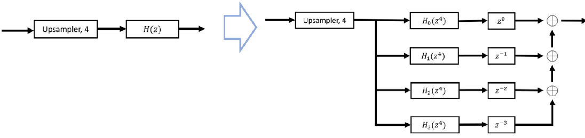

# DESIGN AND IMPLEMENTATION OF AN M-FOLD INTERPOLATOR
<div align="justify">
This report discusses the design and implementation of an M-fold interpolator, with the upsampling factor 𝑀 ∈ ℤ<sup>+</sup>. The filter specification for the anti-imaging filter within the M-fold interpolator is derived based on the sampling theory for the given signal to be interpolated. Two anti-imaging filters with stopband attenuations of 30dB and 60dB are designed following the procedure used to design a Finite-Duration Impulse Response (FIR) Low-Pass filter. The truncation of the Infinite Response initially obtained, is achieved from the Kaiser Window Function. The designed anti-imaging filters are implemented using the polyphase structure and the interpolators are implemented using the efficient structure in MATLAB R2016a. The report presents the magnitude responses and impulse responses of the filters designed to confirm its characteristics with the desired specifications. Further, the performance of the two interpolators designed are evaluated based on the Root Mean Square Error (RMSE) between the sampled signal at the higher sampling rate and the outputs from each interpolator and the computational complexity difference between the original and efficient implementations of the designed interpolators.</div>

## Table of Content
[INTRODUCTION](#introduction)

[METHODOLOGY](#methodology)

* [Deriving Filter specifications](#derivation)
* [Deriving the Kaiser Window parameters](#kaiser)
* [Polyphase Filter Implementation](#implementation)
* [Filter Evaluation](#evaluation)
  
[RESULTS](#results)

[CONCLUSION](#conclusion)

[REFERENCES](#references)

## INTRODUCTION
<div align="justify">
This report describes the step-by-step procedure used to design an M-fold Interpolator with Low-Pass FIR Digital Filter as the Anti-Imaging Filter for prescribed specifications using the windowing method in conjunction with the Kaiser window. The software implementation and the evaluation of the M-fold interpolators was done by MATLAB (Version R2016a)
The ideal passband gains and the passband edge and stopband frequencies were obtained following the sampling theory for the given signal 𝑥[𝑛]. When selecting the passband and stopband edge frequencies, the widest possible transition band was considered as that reduces the need for sharp transitions and hence the order of the filters to be designed. This leads to the lower computational complexity as it increases with the order of the filter.
The closed form direct approach is used by following the Fourier series method to define and design the even-order linear-phase anti-imaging FIR digital filters for the derived and given specifications, while Kaiser Window is used for windowing. The parameters of the Kaiser window were used to tune the filters to the prescribed characteristics. The designed FIR digital filters are then implemented using the polyphase structure such that the implementation of the M-fold interpolators can be done in the efficient structure derived.
The time domain and frequency domain representation of the filters are obtained throughout the different design stages to evaluate the filter characteristics. The frequency responses of the filters were obtained primarily through the Fast Fourier Transform (FFT) algorithm implementation which provides a faster implementation of the Discrete Fourier Transform (DFT). The filters were then evaluated for its capability of successful re-sampling of the original signal with negligible distortion and computations complexities and the reduction of computation complexity with the efficient implementations.</div>

## METHODOLOGY

<div align="justify">
The project has the following requirements.
  
- Deriving the Ideal Passband Gain, Passband, and Stopband Edge frequencies for the Anti-Imaging filters to be designed
- Designing Anti-Imaging filters with two different Stopband attenuations, 𝐻<sub>30</sub>(𝑧) and 𝐻<sub>60</sub>(𝑧)
- Implementing the designed Anti-Imaging filters in Polyphase structure and the M-fold interpolators using the Efficient structure
- Evaluating the performance of the M-fold interpolators in-terms of the ability to re-sample the original signal and the computational complexities.
  
</div>

### Deriving Filter specifications

The passband gains, passband and stopband edges with widest possible transition width are derived in this section. To derive them, I employed the concepts of the sampling theory. For the complete derivation, check the [final report](https://github.com/Kalana304/M-Fold-Interpolator/blob/main/Report/Final%20Report.pdf).

<div align="center">
  
###### *Derived and Specified Parameters*
  
|  Parameter  | Symbol | Value | Units | 
| :----------------: |:------------:| :-------:| :--------: | 
|Upsampling factor  | M | 4 | - | 
|Fundamental frequency   | &Omega;<sub>0</sub> | 60&pi; | rad/s |
|Sampling frequency     | &Omega;<sub>s</sub> | 200&pi; | rad/s |
|Passband Gain   | G<sub>p</sub> | 4 | - |
|Stopband Gain     | G<sub>s</sub> | 0 | - |
|Passband Edge Frequency   | &Omega;<sub>p</sub> | 188.496 | rad/s |
|Cut-off Frequency     | &Omega;<sub>c</sub> | 314.159 | rad/s |
|Stopband Edge Frequency   | &Omega;<sub>ss</sub> | 439.823 | rad/s |
|Transition width     | B<sub>T</sub> | 80 | rad/s |
|Passband Ripple   | A<sub>p</sub> | 0.1 | dB |
|Stopband Attenuation for filter 1     | A<sub>s,30</sub> | 30 | dB |
|Stopband Attenuation for filter 2   | A<sub>s, 60</sub> | 60 | dB |

</div>

### Deriving the Kaiser Window parameters

<div align="justify">
Since the requirement of this project does not need to manually implement the Kaiser windowing method for filter design, the command kaiserord on MATLAB was used to obtain the filter orders 𝑁<sub>𝑃, 30</sub> and 𝑁<sub>𝑃, 60</sub>. Due to the restrictions of the transition band obtained in the previous section, the orders of the two filters, 𝐻<sub>30</sub>(𝑧), 𝐻<sub>60</sub>(𝑧), are slightly higher compared to the theoretically derived filter orders 𝑁<sub>𝑇, 30</sub> and 𝑁<sub>𝑇, 60</sub>. To check out the theoratical derivation of the Kaiser Window parameters check the </div> [final report](https://github.com/Kalana304/M-Fold-Interpolator/blob/main/Report/Final%20Report.pdf).


<div align="center">
  
###### *Derived Kaiser window parameters for 30dB filter (left) and 60dB filter (right)*

|  Parameter  | Value | Units |     |  Parameter  | Value | Units |
| :----------------: |:------------:| :-------:| :----: | :----------------: |:------------:| :-------:| 
|𝛿̃<sub>𝑝</sub>       | 0.00576 | - |  |𝛿̃<sub>𝑝</sub>      | 0.00576 | - |
|𝛿̃<sub>a, 30</sub>   | 0.03162 | - |  |𝛿̃<sub>a, 30</sub>  | 0.001 | - |
|𝛿<sub>30</sub>      | 0.00576 | - |  |𝛿<sub>30</sub>     | 0.001 | - |
|A<sub>a, 30</sub>    | 44.79 | dB |  |A<sub>a, 30</sub>  | 60 | dB |
|A<sub>p, 30</sub>    | 0.1 | dB |  |A<sub>p, 30</sub>    | 0.1 | dB |
|𝑁<sub>𝑇, 30</sub>   | 22 | - |  |𝑁<sub>𝑇, 30</sub>   | 30 | - |
|𝑁<sub>𝑃, 30</sub>   | 26 | - |  |𝑁<sub>𝑃, 30</sub>   | 38 | - |

</div>

### Polyphase Filter Implementation

<div align="justify">
After the order of each filter 𝐻<sub>30</sub>(𝑧) and 𝐻<sub>60</sub>(𝑧) were obtained, the command <I>fir1()</I> of MATLAB was used to obtain the coefficients of the filter for the given specifications.

Based on the polyphase decomposition the two filters 𝐻<sub>30</sub>(𝑧) and 𝐻<sub>60</sub>(𝑧) were implemented following a Type-I design which is shown below.
</div>

<p align = "center">
  
</p>

<div align="justify">
Next, the M-fold interpolator was implemented in the efficient structure derived during the class such that the computation complexity is reduced when processing a sequence. This is shown in the below figure.
</div>

<p align = "center">
  
</p>

<div align="justify">
In MATLAB, the delaying of the sequences obtained in Type-I implementation is done by shifting the row vectors by the corresponding number of samples.
</div>

### Filter Evaluation

<div align="justify">
After the implementation of the filters and the M-fold interpolator in the efficient way, next is to evaluate the performance. For that, two methods were incorporated.
</div>

#### Root Mean Square Error

<div align="justify">
The two filters designed, 𝐻<sub>30</sub>(𝑧) and 𝐻<sub>60</sub>(𝑧), were evaluated on the ability to re-sample the original sequence 𝑥[𝑛] by interpolating it by a factor of 4 to obtain an effective sampling rate of 800&pi; 𝑟𝑎𝑑/𝑠. For this, each of the two output sequences from the two interpolators, 𝑦<sub>30</sub>[𝑛] and 𝑦<sub>60</sub>[𝑛], is compared with the sequence 𝑥<sub>𝑢</sub>[𝑛] which is obtained by sampling the continuous-time signal at a sampling frequency of 800&pi; 𝑟𝑎𝑑/𝑠 using the performance metric RMSE.

Before taking the RMSE, a correction to the output sequences should be done by removing the group delays of each filter from the corresponding output sequence. The group delays obtained were 13 and 19 samples for 𝐻<sub>30</sub>(𝑧) and 𝐻<sub>60</sub>(𝑧) respectively. Even though the polyphase filters may have their own group delays, the final group delay affecting the output of the LTI system is same as the overall filter implemented as it is.

After making the adjustment, samples from 1000 ≤ 𝑛 ≤ 3000 from both the 𝑥<sub>𝑢</sub>[𝑛] and 𝑦<sub>𝑖</sub>[𝑛] are taken to measure the RMSE.
</div>

#### Computational Complexity

<div align="justify">
Next, the two filters were evaluated based on the computational complexity. The computational complexity was measured based on the total number of multiplications and additions performed for the input sequences they process. For this, the following evaluations were done.

  * Evaluating the computational complexity between original implementation and the efficient implementation for each of the filter
  * Comparing the computational complexity between the two filters 𝐻<sub>30</sub>(𝑧) and 𝐻<sub>60</sub>(𝑧) in their efficient implementation.
</div>

## RESULTS

<div align="justify">
In this section, the results of the design and implementation of the M-fold interpolators for 30dB and 60dB stopband attenuations are presented in three subsections. First, the time-domain and frequency-domain analysis of the two anti-imaging filters 𝐻<sub>30</sub>(𝑧) and 𝐻<sub>60</sub>(𝑧) are analyzed. Second, the polyphase decomposition of the two filters is exploited followed by the efficient implementation of the M-fold interpolator. Last, the filters are evaluated based on the RMSE values comparing 𝑦<sub>𝑖</sub>[𝑛] with 𝑥<sub>𝑢</sub>[𝑛] and the computational complexity based on the total number of multiplications and additions performed for the input sequences they process. The details can be found in the [final report](https://github.com/Kalana304/M-Fold-Interpolator/blob/main/Report/Final%20Report.pdf).
</div>

## CONCLUSION
<div align="justify">
The computational efficiency of implementing an M-fold Interpolator using the polyphase structure and efficient implementation is evident with approximately 75% reduction of the multiplications and the additions required to process and upsample the input sequence successfully. Also the two implementations (original and efficient) provide the similar outputs without any additional distortions apart from the group delay which is inherent to the designed digital filter and is not depending on the structure used to implement them. It can be seen , to obtain a higher stopband attenuation, higher order filters are required that increases the computational complexity with a very minimum reduction in the RMSE.
  
Further, the results depicts that the M-fold Interpolator is not only computationally efficient but also provides a very close representation of a sequence sampled at a sampling frequency M times higher than the sampling frequency used to obtain input sequence.
  
When designing the Anti-Imaging filters, the flexibility of the Kaiser Window has been incorporated. Since the ideal filters cannot be practically implemented, it is advantageous to be able to make a flexible filter of which the limitations can be controlled. This is a practical approach since small imperfections such as pass band ripple will not cause an observable difference in the filtered output. This means that the parameters of the filter can be adjusted until the differences between the filter output and an ideal output become indistinguishable for all the practical purposes. </div>

## REFERENCES

```
[1] Alan V. Oppenheim and Ronald W. Schafer. 2009. Discrete-Time Signal Processing (3rd. ed.). Prentice Hall Press, USA.
```

```
[2] Adams, M. D. (2013). Multiresolution signal and geometry processing: filter banks, wavelets, and subdivision (version: 2013-09-26). Michael Adams.
```
