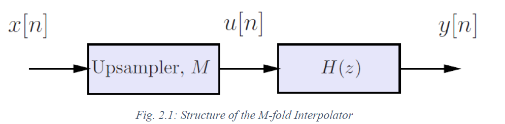

# DESIGN AND IMPLEMENTATION OF AN M-FOLD INTERPOLATOR

This report discusses the design and implementation of an M-fold interpolator, with the upsampling factor 𝑀 ∈ ℤ+. The filter specification for the anti-imaging filter within the M-fold interpolator is derived based on the sampling theory for the given signal to be interpolated. Two anti-imaging filters with stopband attenuations of 30dB and 60dB are designed following the procedure used to design a Finite-Duration Impulse Response (FIR) Low-Pass filter. The truncation of the Infinite Response initially obtained, is achieved from the Kaiser Window Function. The designed anti-imaging filters are implemented using the polyphase structure and the interpolators are implemented using the efficient structure in MATLAB R2016a. The report presents the magnitude responses and impulse responses of the filters designed to confirm its characteristics with the desired specifications. Further, the performance of the two interpolators designed are evaluated based on the Root Mean Square Error (RMSE) between the sampled signal at the higher sampling rate and the outputs from each interpolator and the computational complexity difference between the original and efficient implementations of the designed interpolators.

## Table of Content
[INTRODUCTION](#introduction)

[METHODOLOGY](#method)

* [Deriving Filter specifications](#derivation)
* [Deriving the Kaiser Window parameters](#kaiser)
* [Polyphase Filter Implementation](#implementation)
* [Filter Evaluation](#evaluation)
  
[RESULTS](#results)

* [Time and Frequency domain analysis of the designed filters](#analysis)
* [Polyphase Filter Magnitude Spectra](#spectra)
* [Filter Evaluation](#eval)

[CONCLUSION](#conclusion)

[REFERENCES](#references)

## INTRODUCTION

This report describes the step-by-step procedure used to design an M-fold Interpolator with Low-Pass FIR Digital Filter as the Anti-Imaging Filter for prescribed specifications using the windowing method in conjunction with the Kaiser window. The software implementation and the evaluation of the M-fold interpolators was done by MATLAB (Version R2016a)
The ideal passband gains and the passband edge and stopband frequencies were obtained following the sampling theory for the given signal 𝑥[𝑛]. When selecting the passband and stopband edge frequencies, the widest possible transition band was considered as that reduces the need for sharp transitions and hence the order of the filters to be designed. This leads to the lower computational complexity as it increases with the order of the filter.
The closed form direct approach is used by following the Fourier series method to define and design the even-order linear-phase anti-imaging FIR digital filters for the derived and given specifications, while Kaiser Window is used for windowing. The parameters of the Kaiser window were used to tune the filters to the prescribed characteristics. The designed FIR digital filters are then implemented using the polyphase structure such that the implementation of the M-fold interpolators can be done in the efficient structure derived.
The time domain and frequency domain representation of the filters are obtained throughout the different design stages to evaluate the filter characteristics. The frequency responses of the filters were obtained primarily through the Fast Fourier Transform (FFT) algorithm implementation which provides a faster implementation of the Discrete Fourier Transform (DFT). The filters were then evaluated for its capability of successful re-sampling of the original signal with negligible distortion and computations complexities and the reduction of computation complexity with the efficient implementations.

## METHODOLOGY

The project has the following requirements.
  
- Deriving the Ideal Passband Gain, Passband, and Stopband Edge frequencies for the Anti-Imaging filters to be designed
- Designing Anti-Imaging filters with two different Stopband attenuations, 𝐻30(𝑧) and 𝐻60(𝑧)
- Implementing the designed Anti-Imaging filters in Polyphase structure and the M-fold interpolators using the Efficient structure
- Evaluating the performance of the M-fold interpolators in-terms of the ability to re-sample the original signal and the computational complexities.
  

### Deriving Filter specifications

The passband gains, passband and stopband edges with widest possible transition width are derived in this section. To derive them, I will be employing the concepts of the sampling theory.

  

First, consider the continuous time signal 𝑥𝑐(𝑡)=2𝑐𝑜𝑠(2π𝑓0𝑡) that corresponds to the given sequence 𝑥[𝑛]=2cos (2𝜋𝑓0𝑛𝑇𝑠), which is bandlimited. Using the Fourier transform, we obtain the frequency representation of the 𝑥𝑐(𝑡), denoted by 𝑋𝑐(Ω) as follows: 𝑋𝑐(Ω)=2πδ(Ω−Ω0)+2πδ(Ω+Ω0),𝑤ℎ𝑒𝑟𝑒 Ω0=2π𝑓0
By sampling the 𝑥𝑐(𝑡) at a sampling rate of 𝑓𝑠 ( ≥2𝑓0), we can obtain the 𝑥𝑠(𝑡) with the Fourier Transform of 𝑋𝑠(Ω) as follows: 𝑥𝑠(𝑡)=Σ𝑥𝑐(𝑛𝑇𝑠)δ(𝑡−𝑛𝑇𝑠)∞𝑛 = −∞ = Σ2𝑐𝑜𝑠(2π𝑓0𝑛𝑇𝑠)δ(𝑡−𝑛𝑇𝑠)∞𝑛 = −∞
and 𝑋𝑠(Ω)=1𝑇𝑠Σ𝑋𝑐(Ω−2𝜋𝑓𝑠𝑘)∞𝑘= −∞= 2𝜋𝑇𝑠Σ[𝛿(Ω−Ω𝑠𝑘−Ω0 )+ 𝛿(Ω−Ω𝑠𝑘+Ω0 )]∞𝑘= −∞
Now the given signal 𝑥[𝑛] can be obtained as follows: 𝑥[𝑛]= ∫𝑥𝑐(𝑛𝑇𝑠)δ(𝑡−𝑛𝑇𝑠)∞−∞ 𝑑𝑡= 𝑥𝑐(𝑛𝑇𝑠)= 2𝑐𝑜𝑠(2π𝑓0𝑛𝑇𝑠)
Fig. 2.1: Structure of the M-fold Interpolator
3
The Discrete-Time-Fourier-Transform (DTFT) of 𝑥[𝑛], which is denoted by 𝑋(𝜔), can be obtained by the evaluating 𝑋𝑠(Ω) at Ω=𝜔𝑇𝑠⁄. 𝑋(𝜔)= 𝑋𝑠(Ω)|Ω= 𝜔𝑇𝑠= 2𝜋𝑇𝑠Σ[𝛿( 𝜔𝑇𝑠−2𝜋𝑓𝑠𝑘−2π𝑓0 )+ 𝛿( 𝜔𝑇𝑠−2𝜋𝑓𝑠𝑘+2π𝑓0 )]∞𝑘= −∞ 𝑋(𝜔)= 2𝜋𝑇𝑠Σ[𝛿( 1𝑇𝑠(𝜔−𝜔𝑠𝑘−𝜔0) )+ 𝛿( 1𝑇𝑠(𝜔−𝜔𝑠𝑘+𝜔0))], 𝑤ℎ𝑒𝑟𝑒 𝜔𝑠= 2𝜋,𝜔0=2𝜋𝑓0𝑇𝑠 ∞𝑘= −∞ Using the relationship of 𝛿(𝑥𝑇)=𝑇𝛿(𝑥) 𝑋(𝜔)=2𝜋 Σ[𝛿( 𝜔−𝜔𝑠𝑘−𝜔0)+ 𝛿( 𝜔−𝜔𝑠𝑘+𝜔0)]∞𝑘= −∞
Now consider the upsampled signal, 𝑢[𝑛] by a factor 𝑀 ∈ ℤ+ and its Fourier transform 𝑈(𝜔). 𝑢[𝑛]= {𝑥[𝑛𝑀],𝑖𝑓 𝑀|𝑛 0,𝑜𝑡ℎ𝑒𝑟𝑤𝑖𝑠𝑒 𝑈(𝜔)=𝑋(𝑀𝜔)= 2𝜋 Σ[𝛿( M𝜔−𝜔𝑠𝑘−𝜔0)+ 𝛿( M𝜔−𝜔𝑠𝑘+𝜔0)]∞𝑘= −∞ 𝑈(𝜔)=2𝜋 Σ[𝛿( M(𝜔−𝜔𝑠𝑘𝑀−𝜔0𝑀))+ 𝛿( M(𝜔−𝜔𝑠𝑘𝑀+𝜔0𝑀))]∞𝑘= −∞ 𝑈(𝜔)=2𝜋𝑀 Σ[𝛿( 𝜔−𝜔𝑠𝑘𝑀−𝜔0𝑀)+ 𝛿( 𝜔−𝜔𝑠𝑘𝑀+𝜔0𝑀)]∞𝑘= −∞ Now consider a sampled signal 𝑥𝑢[𝑛] at a sampling frequency 𝑓𝑠′=𝑀𝑓𝑠 with a Fourier transformation 𝑋𝑢(𝜔). 𝑋𝑢(𝜔)=2𝜋 Σ[𝛿( 𝜔−𝜔𝑠′ 𝑘−𝜔0)+ 𝛿( 𝜔−𝜔𝑠′ 𝑘+𝜔0)], 𝑤ℎ𝑒𝑟𝑒 𝜔𝑠′ =𝑀𝜔𝑠∞𝑘= −∞ Since 𝜔𝑠′ 𝑘= 𝑀𝜔𝑠𝑘=2𝜋𝑓𝑠(𝑀𝑘), this has the same impact when taking the summation from −∞ to ∞ as with 2𝜋𝑓𝑠𝑘. By changing the summation variable to 𝑘′=𝑀𝑘: 𝑋𝑢(𝜔)=2𝜋 Σ[𝛿( 𝜔−𝜔𝑠𝑘′−𝜔0)+ 𝛿( 𝜔−𝜔𝑠𝑘′+𝜔0)]∞𝑘′= −∞ The objective of the interpolator is to process and convert a sequence sampled at a lower sampling frequency to a higher sampling frequency by a factor 𝑀 ∈ ℤ+. Hence by definition, 𝑦[𝑛] and 𝑥𝑢[𝑛] should be the same and that results 𝑌(𝜔) and 𝑋𝑢(𝜔) to be same.
4
The spectral components of 𝑥𝑢[𝑛] will be located at 2𝜋𝑓0𝑀𝑓𝑠 𝑟𝑎𝑑/𝑠𝑎𝑚𝑝𝑙𝑒 within the 0− 𝜋 𝑟𝑎𝑑/𝑠𝑎𝑚𝑝𝑙𝑒. During the upsampling, the phenomena known as “imaging” occurs where multiple spectral components get located within 0− 𝜋 𝑟𝑎𝑑/𝑠𝑎𝑚𝑝𝑙𝑒 including the spectral component at 2𝜋𝑓0𝑀𝑓𝑠 in the spectra of 𝑢[𝑛]. To remove the unnecessary images present and to filter the spectral component at 2𝜋𝑓0𝑀𝑓𝑠 from 𝑈(𝜔) following Ideal Low-Pass filter can be defined. 𝐻(𝜔)= {𝐺𝑝,𝑓𝑜𝑟 0 ≤ |𝜔| ≤ 𝜋𝑀0,𝑓𝑜𝑟 𝜋𝑀 ≤ |𝜔| ≤ 𝜋
Then we can obtain the 𝑌(𝜔) as follows: 𝑌(𝜔)=2𝜋𝐺𝑝𝑀 Σ[𝛿( 𝜔−𝜔𝑠𝑘𝑀−𝜔0𝑀)+ 𝛿( 𝜔−𝜔𝑠𝑘𝑀+𝜔0𝑀)]∞𝑘= −∞
To achieve the objective of 𝑌(𝜔)= 𝑋𝑢(𝜔), we can see that 𝐺𝑝=𝑀.
Table 2.1: Parameters provided in project description
Based on the provided data, the images are to occur at 140𝜋,260𝜋 and 340𝜋 𝑟𝑎𝑑/𝑠 (in normalized frequencies; 0.35𝜋,0.65𝜋 and 0.85𝜋 𝑟𝑎𝑑/𝑠𝑎𝑚𝑝𝑙𝑒) with the required spectral component at 60𝜋 𝑟𝑎𝑑/𝑠. Since the practical filters designed do not have very sharp transition, we need to derive the passband and stopband edge frequencies satisfying two needs:
a. The required spectral component at 60𝜋 𝑟𝑎𝑑/𝑠 should be filtered without any distortion.
b. The images present should be attenuated to a satisfactory level.
Further, to reduce the order of the filter, hence the computational complexity, the widest transition width should be considered when determining the passband and stopband edge frequencies. Considering these three factors, the passband edge frequency can be selected as 60𝜋 𝑟𝑎𝑑/𝑠 and stopband edge frequency can be selected as 140𝜋 𝑟𝑎𝑑/𝑠.Hence the specification of the anti-imaging filters to be designed are stated in the Table 2.2.
Parameter
Symbol
Value
Units
Upsampling factor
M
4
-
Fundamental frequency
Ω0
60𝜋
𝑟𝑎𝑑/𝑠
Sampling frequency
Ω𝑠
200𝜋
𝑟𝑎𝑑/𝑠

### Deriving the Kaiser Window parameters

### Polyphase Filter Implementation

### Filter Evaluation

## RESULTS

### Time and Frequency domain analysis of the designed filters

### Polyphase Filter Magnitude Spectra

### Filter Evaluation

## CONCLUSION

The computational efficiency of implementing an M-fold Interpolator using the polyphase structure and efficient implementation is evident with approximately 75% reduction of the multiplications and the additions required to process and upsample the input sequence successfully. Also the two implementations (original and efficient) provide the similar outputs without any additional distortions apart from the group delay which is inherent to the designed digital filter and is not depending on the structure used to implement them. It can be seen , to obtain a higher stopband attenuation, higher order filters are required that increases the computational complexity with a very minimum reduction in the RMSE.
  
Further, the results depicts that the M-fold Interpolator is not only computationally efficient but also provides a very close representation of a sequence sampled at a sampling frequency M times higher than the sampling frequency used to obtain input sequence.
  
When designing the Anti-Imaging filters, the flexibility of the Kaiser Window has been incorporated. Since the ideal filters cannot be practically implemented, it is advantageous to be able to make a flexible filter of which the limitations can be controlled. This is a practical approach since small imperfections such as pass band ripple will not cause an observable difference in the filtered output. This means that the parameters of the filter can be adjusted until the differences between the filter output and an ideal output become indistinguishable for all the practical purposes. 

## REFERENCES
